# add Comments

<p align="center">
  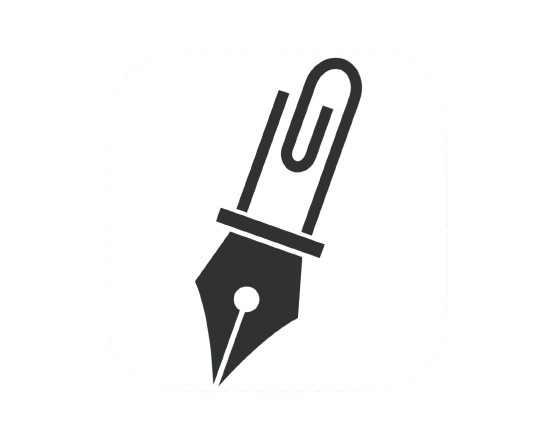
</p>

### 어디에서든 댓글을 작성하고 해당 댓글을 손쉽게 공유할 수 있는 크롬 익스텐션 서비스 입니다.

## **🔗 Link**

[크롬익스텐션 레포](https://github.com/JungDeunGyul/itsComments-Extension)

[클라이언트 레포](https://github.com/JungDeunGyul/itsComments-Front)

[서버 레포](https://github.com/JungDeunGyul/itsComments-Back)

<br>

# 📕 Contents

- [💪 Project Background & Progress](#-project-background--progress)
  - [1. 프로젝트 배경 및 동기](#1-프로젝트-배경-및-동기)
    - [프로젝트 배경](#프로젝트-배경)
    - [프로젝트 동기](#프로젝트-동기)
  - [2. 프로젝트 소개](#2-프로젝트-소개)
  - [3. 프로젝트 일정](#3-프로젝트-일정)
  - [Chrome Extension으로 작업 한 이유](#chrome-extension으로-작업-한-이유)
    - [Chrome Extension은 어떻게 작동할까?](#chrome-extension은-어떻게-작동할까)
  - [바닐라 자바스크립트 대신 React를 선택한 이유](#바닐라-자바스크립트-대신-react를-선택한-이유)
    - [1. 컴포넌트 기반 아키텍처](#1-컴포넌트-기반-아키텍처)
    - [2. Virtual Domd의 성능 최적화](#2-virtual-dom의-성능-최적화)
    - [3. 단방향 데이터 흐름](#3-단방향-데이터-흐름)
    - [4. 유지보수와 확장성](#4-유지보수와-확장성)
    - [5. SPA 구현의 용이성](#5-spa-구현의-용이성)
    - [6. 결론](#6-결론)
  - [Why SSE?](#why-sse)
    - [1. 연결 및 해제 비용](#1-연결-및-해제-비용)
    - [2. 배터리 소모량](#2-배터리-소모량)
    - [3. Chrome 익스텐션 환경](#3-chrome-익스텐션-환경)
- [🔍 Preview](#-preview)
- [🛠 Tech Stacks](#-tech-stacks)
- [💾 Features](#-features)
- [🤫 Pain point](#-pain-point)
  - [1. 비회원 댓글을 한시간 뒤에 어떻게 삭제할까?](#1-비회원-댓글을-한시간-뒤에-어떻게-삭제할까)
    - [[해결방법 1]: UseQuery를 사용한 클라이언트 측 자동 삭제](#해결방법-1-usequery를-사용한-클라이언트-측-자동-삭제)
    - [[해결방법 2]: 서버 측 Cron 작업을 이용한 삭제](#해결방법-2-서버-측-cron-작업을-이용한-삭제)
    - [[해결방법 3]: MongoDB의 TTL(Time-To-Live) 기능을 활용한 자동 삭제](#해결방법-3-mongodb의-ttltime-to-live-기능을-활용한-자동-삭제)
  - [2. 이미지를 어떻게 저장하고, 불러올까?](#2-이미지를-어떻게-저장하고-불러올까)
    - [[해결방법 1]: 이미지를 base64 사용하여 인코딩, 디코딩](#해결방법-1-이미지를-base64-사용하여-인코딩-디코딩)
      - [base64의 문제점](#base64의-문제점)
    - [[해결방법 2]: AWS S3 사용하기](#해결방법-2-aws-s3-사용하기)
      - [S3에 CloudFront 적용하기](#s3에-cloudfront-적용하기)
      - [S3만 사용 vs CloudFront 적용 비교](#s3만-사용-vs-cloudfront-적용-비교)
        - [S3만 사용하는 경우 장단점](#s3만-사용하는-경우-장단점)
        - [CloudFront 적용 장단점](#cloudfront-적용-장단점)
  - [3. 일관 되지 않은 스타일](#3-일관-되지-않은-스타일)
    - [[해결방법 1]: 3가지의 접근 방식 적용](#3가지의-접근-방식-적용)
      - [3 가지의 접근 방식 실패 요인](#3-가지의-접근-방식-실패-요인)
    - [[해결방법 2]: Shadow DOM 사용](#해결방법-2-shadow-dom-사용)
      - [Shadow DOM의 closed 속성](#shadow-dom의-closed-속성)
- [👨🏻‍🏫 Memoir](#-memoir)

<br>

# **💪 Project Background & Progress**

### 1. 프로젝트 배경

#### 프로젝트 배경
---

일상적인 작업이나 학습 활동 중에 발생하는 정보 전달 과정은 번거로운 과정을 거치고 있습니다. 특히, 특정 페이지나 내용을 다른 사람에게 전달하거나 협업 시 특정 부분에 대한 수정 요청을 할 때, 현재의 플로우는 다음과 같은 번거로운 작업들로 이뤄져 있습니다.

1. **링크 복사 및 스크린샷/내용 저장:**
   - 특정 페이지의 링크를 복사하고, 해당 페이지의 특정 부분에 대한 스크린샷을 찍거나 내용을 복사하여 저장합니다.

2. **메일이나 메신저로 전달:**
   - 저장한 정보를 이메일이나 메신저를 통해 상대방에게 전달합니다.

3. **수정 요청 시 스크린샷 및 정리:**
   - 협업 시, 특정 부분에 대한 수정을 요청할 때는 해당 부분의 스크린샷을 찍고 수정이 필요한 내용을 정리하여 다시 전달합니다.

> 저희는 이러한 번거로운 작업들을 간소화하고자, 이 프로젝트를 기획하게 되었습니다.

### 2. 프로젝트 소개
---

addComments는 모든 웹 페이지에 대한 URL 공유 및 해당 페이지 스크린샷 공유, 해당 페이지에 댓글를 작성할 수 있는 크롬 확장자입니다. 이 확장자는 자신이 스크린샷을 찍은 것과, 다른 사람이 자신을 태그해서 받은 댓글들을 보관하여 해당 부분에 대해 의논을 할 수 있습니다.

사용자간 웹페이지의 특정 부분을 스크린샷을 찍고 댓글을 달며, 해당 URL를 한번에 공유함으로써 효율성을 향상시킬 수 있습니다.

**주요 기능**
---

### 크롬익스텐션 기능
---

1. **댓글 작성**
    - 사용자는 원하는 위치에 댓글을 작성할 수 있습니다.
    - 댓글은 팝업의 버튼과 단축키(comment + shift + y)를 이용해서 활성화 시킬수 있습니다.
    - 활성화 시 마우스 커서에 검정 원이 추가되고 클릭시 해당 위치에 댓글 작성 모달이 생성됩니다.

2. **댓글 공유**
    - 사용자는 작성하는 댓글을 다른 사람과 공유할 수 있습니다.
    - 사용자는 댓글입력창에 @를 입력하면 친구목록 드롭다운 버튼 표시
    - 공유할 친구를 선택시 해당 친구에게 댓글을 공유할 수 있습니다.
    - 메일입력창에 공유하고자 하는 메일주소를 작성하여 메일을 통해 공유할 수 있다.
    - 해당 댓글 작성시 공개 비공개를 선택 할 수 있다.
    - 공개 댓글의 경우 익스텐션을 설치한 모든 유저가 확인 가능
    - 비공개 댓글의 경우 작성자 본인과 공유된 사용자만 확인 가능

3. **댓글 표시**
    - 댓글 작성시 해당 위치에 작성자의 프로필 아이콘이 해당 위치에 표시가 됩니다.
    - 해당 아이콘에 마우스를 가져가면 댓글 작성자, 댓글내용, 댓글 상세페이지로 이동 버튼이 표시가 됩니다.

### 클라이언트 페이지
---

1. **대시보드**
    - My Comments 클릭시 사용자가 작성한 댓글을 표시됩니다
    - Received Comments 클릭시 사용자가 태그된 댓글을 표시됩니다

2. **싱글뷰**
    - 좌측에 댓글의 작성자, 내용, 스크린샷과 댓글 상세페이지로 이동, url로 이동 버튼이 표시
    - 우측에 사용자가 작성한 댓글, 사용자가 태그된 댓글을 최신순으로 표기
    - 클릭시 좌측 댓글 변경

3. **친구**
    - 친구 목록이 표시됩니다.
    - 친구를 추가하고 삭제할수있습니다.

4. **댓글 상세 페이지**
    - 좌측에 해당 댓글에 스크린샷 표시됩니다.
    - 우측에 해당 댓글의 정보가 표시됩니다.
    - reply 클릭시 답글을 작성할 수 있습니다.

5. **댓글 삭제**
    - 댓글 상세페이지 이동시 댓글 작성자의 경우 댓글 삭제버튼(🗑️)이 표시
    - 해당 버튼 클릭시 삭제 확인 모달 표시
    - 삭제 버튼 클릭시 해당 댓글 삭제

<br>

## Chrome Extension으로 작업 한 이유

Chrome 확장 프로그램의 가장 큰 장점은 어떤 작업을 수행하기 위해 한 플랫폼에서 다른 플랫폼으로 전환할 필요가 없다는 것입니다. 언제든 이러한 확장 프로그램에 액세스할 수 있습니다.

또한 Google Chrome 앱만 있으면 모든 PC, Mac 또는 Windows에서 확장 프로그램을 사용할 수 있으므로 누구나 액세스할 수 있습니다.

### Chrome Extension은 어떻게 작동할까?
---

<p align="center">
  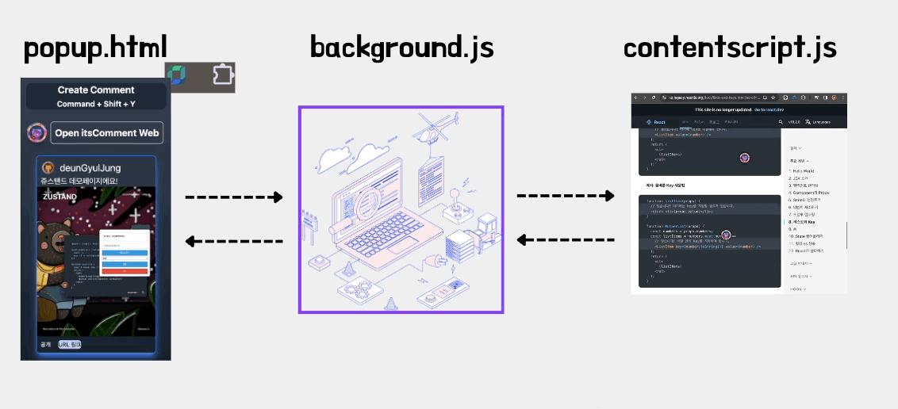
</p>

#### popup.html
---

- 익스텐션의 팝업 창을 정의합니다. 보통 사용자가 익스텐션 아이콘을 클릭하면 나타나는 작은 창이며, 여기에 사용자 인터페이스 요소를 배치할 수 있습니다.
- HTML과 CSS를 사용하여 팝업 창의 레이아웃과 스타일을 설계합니다.
- 사용자와의 상호작용을 위한 버튼, 입력 필드 등을 포함할 수 있습니다.
- 일반적으로 팝업 창은 사용자가 짧은 작업을 수행하거나 익스텐션의 설정을 변경할 수 있는 기능을 제공합니다.

#### background.js
---

- 백그라운드 스크립트는 익스텐션의 수명 주기 동안 실행되는 JavaScript 코드를 포함합니다.
- 주로 익스텐션의 전역적인 상태 관리, 이벤트 처리, 백그라운드 작업 처리 등을 담당합니다.
- 익스텐션이 설치되면 백그라운드 스크립트가 자동으로 실행되며, 익스텐션의 핵심 로직을 구현합니다.
- 백그라운드 스크립트는 주로 브라우저 이벤트를 감지하고, 이벤트에 대응하여 알맞은 동작을 수행합니다.

#### contentscript.js
---

- 웹 페이지의 컨텐츠에 대한 조작이나 수정을 담당합니다.
- 익스텐션에서 특정 웹페이지를 대상으로 동작해야 할 때 사용됩니다.
- 유일하게 웹 페이지의 DOM 요소를 조작하거나 이벤트를 감지하여 동적으로 웹 페이지의 내용을 변경할 수 있습니다.
- 주로 웹 페이지와의 상호작용이 필요한 경우에 사용됩니다.

<br>

### 바닐라 자바스크립트 대신 React를 선택한 이유
---

#### 1. 컴포넌트 기반 아키텍처
---

React의 장점:

- 재사용성: React의 컴포넌트 기반 아키텍처는 UI를 재사용 가능한 모듈로 나누어 개발할 수 있게 합니다. 이는 유지보수와 확장이 용이하며, 코드의 일관성을 유지하는 데 도움이 됩니다.

- 구조화된 코드: 복잡한 UI를 작은 컴포넌트로 분리하여 관리할 수 있어 코드가 더 구조적이고 관리하기 쉬워집니다.

바닐라 자바스크립트의 단점:

- 재사용성 부족: 바닐라 자바스크립트에서는 컴포넌트 개념이 명확하지 않아 UI 요소를 재사용하려면 많은 중복 코드가 발생할 수 있습니다.

- 코드 구조화 어려움: 복잡한 애플리케이션의 경우, 코드를 구조화하고 관리하기 어렵습니다. 이는 특히 유지보수와 확장에 불리합니다.

#### 2. Virtual DOM의 성능 최적화
---

React의 장점:

- 효율적인 업데이트: React의 Virtual DOM은 실제 DOM 조작을 최소화하여 성능을 최적화합니다. 이는 특히 많은 UI 업데이트가 필요한 애플리케이션에서 유용합니다.

- 빠른 렌더링: Virtual DOM 덕분에 변경 사항을 빠르게 반영할 수 있어 사용자 경험이 개선됩니다.

바닐라 자바스크립트의 단점:

- DOM 조작의 복잡성: 바닐라 자바스크립트로는 DOM을 직접 조작해야 하므로, 변경 사항이 많을 경우 성능이 저하될 수 있습니다.

- 성능 문제: 잦은 DOM 업데이트가 필요한 경우, 성능 최적화를 직접 구현해야 하며 이는 복잡하고 오류가 발생할 수 있습니다.

#### 3. 단방향 데이터 흐름
---

React의 장점:

- 데이터 관리의 용이성: React는 단방향 데이터 흐름을 채택하여 데이터의 흐름을 명확하게 관리할 수 있습니다. 이는 디버깅을 쉽게 하고, 데이터 상태를 예측 가능하게 만듭니다.

- 상태 관리 라이브러리: Redux, Context API, Zustand 등의 다양한 상태 관리 라이브러리를 통해 복잡한 애플리케이션의 상태를 효율적으로 관리할 수 있습니다.

바닐라 자바스크립트의 단점:

- 복잡한 상태 관리: 바닐라 자바스크립트로는 상태 관리를 직접 구현해야 하며, 이는 코드 복잡성을 증가시키고 유지보수를 어렵게 만듭니다.

- 데이터 흐름 추적의 어려움: 데이터가 여러 방향으로 흐를 수 있어 디버깅이 어렵고, 데이터의 일관성을 유지하기가 힘듭니다.

#### 4. 유지보수와 확장성
---

React의 장점:

- 코드 유지보수 용이: 컴포넌트 기반의 구조 덕분에 코드가 분리되어 있어 유지보수가 쉽습니다.

- 확장성: 새로운 기능을 추가할 때 기존 코드를 크게 수정하지 않고도 확장할 수 있습니다.

바닐라 자바스크립트의 단점:

- 코드 유지보수 어려움: 코드가 분리되지 않아 유지보수 시 혼란이 발생할 수 있습니다.

- 확장성의 한계: 새로운 기능을 추가할 때 기존 코드를 많이 수정해야 할 수 있으며, 이는 버그 발생 가능성을 높입니다.

#### 5. SPA 구현의 용이성
---

React의 장점:

- SPA의 효율적 구현: React는 SPA 구현을 염두에 두고 설계되었으며, Virtual DOM, 상태 관리 라이브러리, 클라이언트 측 라우팅을 위한 React Router 등 SPA 구현을 위한 다양한 도구를 제공합니다.

- 빠른 전환과 사용자 경험: React의 Virtual DOM과 효율적인 상태 관리는 SPA에서 빠르고 매끄러운 페이지 전환을 가능하게 하여 편안한 사용자 경험을 제공합니다.

바닐라 자바스크립트의 단점:

- 직접적인 DOM 조작과 상태 관리: Vanilla JS로 SPA를 구현하려면 DOM 조작과 상태 관리를 직접 해야 하며, 이는 코드의 복잡성을 증가시키고 유지보수를 어렵게 만듭니다.

- 라우팅의 어려움: 클라이언트 측 라우팅을 직접 구현해야 하며, 이는 프로젝트가 커질수록 복잡해집니다.

#### 6. 결론
---

> 이 프로젝트에서 React를 선택한 이유는 컴포넌트 기반 아키텍처, Virtual DOM의 성능 최적화, 단방향 데이터 흐름, 유지보수와 확장성, 그리고 SPA 구현의 용이성 등 다양한 장점 때문입니다.
>
> 반면 바닐라 자바스크립트를 사용하면 재사용성 부족, DOM 조작의 복잡성, 상태 관리의 어려움, 라우팅 구현의 어려움, 그리고 유지보수의 어려움 등 여러 가지 단점이 발생할 수 있습니다.
>
> 이러한 이유로 React를 사용하여 프로젝트를 효율적으로 개발하고, 사용자에게 편안한 경험을 제공할 수 있었습니다.

<br>

## Why SSE?

<p align="center">
  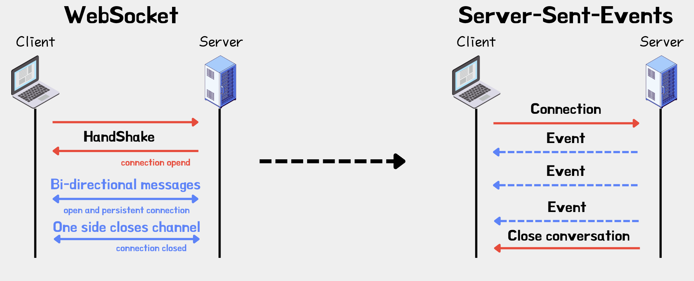
</p>

저희는 프로젝트 초기에는 webSocket를 사용하여 프로젝트를 진행하려고 하였습니다.

하지만 프로젝트를 진행하면서 자주 변경되지 않는 댓글이나, 태그된 인원에게 알람을 주는 일을 SSE보다 비용이 많이 드는 webSocket을 사용할 필요는 없다고 판단하였습니다. websocket과 SSE를 비교하여 프로젝트에 유리한 SSE를 선택하게되었습니다.

### 1. 연결 및 해제 비용
---

WebSocket과 SSE는 모두 실시간 통신을 가능하게 합니다. 그러나 WebSocket은 양방향 통신을 지원하기 때문에 연결 및 해제 과정에서 추가 비용이 발생합니다. 반면 SSE는 HTTP 연결을 통해 단방향 통신을 제공하므로, 각 이벤트 스트림은 독립적으로 유지됩니다. 이는 새로운 연결을 맺거나 끊는 과정에서 소켓에 비해 더 적은 오버헤드를 발생시킵니다. 프로젝트에서는 자주 변경되지 않는 정보를 전송하는 경우가 많아 SSE가 효율적인 선택이 되었습니다.

### 2. 배터리 소모량
---

WebSocket은 백그라운드에서 지속적으로 활성화된 상태를 유지해야 하므로 배터리 소모량이 증가합니다. 반면 SSE는 한 번 연결된 후 서버에서 이벤트가 발생할 때까지 기다리는 방식이므로 네트워크 사용량이 적어 배터리 소모량이 적습니다. 특히 Chrome 익스텐션 환경에서는 배터리 소모량을 최소화하는 것이 중요하므로 SSE가 더 적합한 방법이라고 생각하였습니다.

### 3. Chrome 익스텐션 환경
---

Chrome 익스텐션에서는 백그라운드 페이지와 팝업 페이지가 서로 다른 환경에서 실행됩니다. 이러한 보안상의 이유로 백그라운드 페이지에서는 다른 파일을 직접 import 할 수 없습니다. SSE는 HTTP를 기반으로 하기 때문에 이러한 제약을 우회할 수 있습니다. 따라서 보안상의 이유로 인해 직접 파일 import가 허용되지 않는 Chrome 익스텐션 환경에서도 SSE를 원활하게 사용할 수 있습니다.

> 이렇게 SSE를 선택함으로써 프로젝트의 효율성을 높이고, 성능을 최적화 할 수 있었습니다.

<br>

### 3. 프로젝트 일정
---

#### 프로젝트 기간: 2024.02.01(월) ~ 2024.02.23(금)

**2024.02.01 - 2024.02.07**

- 프로젝트 아이디어 선정
- POC 진행
- KANBAN 작성
- 기술스택 선정
- 보일러 플레이트 생성
- 크롬익스텐션 로그인, Popup Screen 구현

**2024.02.08 - 2024.02.12**

- 댓글 작성 기능 구현
- 댓글 토글 팝업 구현
- 안 읽은 메시지 Feed에 보이게 구현
- 웹 페이지 로그인 연동

**2024.02.13 - 2024.02.19**

- 친구 추가, 삭제 기능 구현
- 메일 전달 구현
- SSE 알람 전달 구현

**2024.02.13 - 2024.02.19**

- 비회원 기능 추가
- 클라우드 프론트 s3 연동
- 네틀리파이 배포
- aws 배포
- 크롬익스텐션 배포
- README 작성

<br>

# **🔍 Preview**

<p align="center">
  
</p>

<p align="center">
  사용자가 모든 웹페이지에 댓글을 남길 수 있으며, 해당 댓글의 url을 클릭하면 해당 댓글에 있는 위치 까지 이동합니다.
</p>

<br>

# **🛠 Tech Stacks**

## Extension


## Client


## Server


## Test


## Deployment


<br>

## 💾 Features

addComments 서비스의 주요 기능입니다.

큰 맥락으로는 유저가 모든 웹사이트 내에서 스크린샷을 찍고 해당 위치에 댓글을 달 수 있게 구현하였습니다.

### 1. 해당 웹 페이지 스크린샷 찍고 댓글 작성하기

<p align="center">
  
</p>

- 모든 웹 페이지에서 스크린샷을 찍고 댓글을 작성하여 자신과 친구, 비회원 유저에게는 메일로 해당 내용을 전송할 수 있습니다.

### 2. 해당 스크린샷 및 댓글 친구 추가가 되어있는 사람에게 전송하기

<p align="center">
  
</p>

- 사용자는 친구추가가 되어있는 유저에게 해당 스크린샷과 내용을 전송할 수 있습니다.

### 3. 다른 유저에게 메일로 내용 전송하기

<p align="center">
  
</p>

- 비회원인 유저에게는 태그 기능을 이용해서 보낼 수 없기 때문에 메일로 스크린샷과 댓글을 볼 수 있는 기능을 구현하였습니다.

<br>

# **🤫 Pain point**

## 1. 비회원 댓글을 한시간 뒤에 어떻게 삭제할까?

이번 프로젝트 진행 과정에서, 사용자 경험 향상을 위한 한 가지 중요한 결정으로, 익스텐션이 설치된 경우 비회원 사용자도 댓글을 작성할 수 있게 하였습니다. 이는 접근성을 높이고 사용자 참여를 촉진하기 위한 조치였습니다.

하지만, 비회원 사용자가 댓글을 작성할 수 있게 되면서 동시에 무분별한 댓글 작성의 가능성이 증가했습니다. 이러한 문제를 해결하고자, 비회원 사용자가 작성한 댓글은 1시간 후에 자동으로 삭제되는 기능을 도입하기로 결정하였습니다. 이 기능은 댓글의 질을 유지하고, 서비스 관리에 있어서도 효율성을 제공할 것입니다.

이를 구현하기 위해, 다음 세 가지 방법을 고려하게 되었습니다:

### **[해결방법 1]: UseQuery를 사용한 클라이언트 측 자동 삭제**
---

UseQuery는 리액트 쿼리 라이브러리의 일부로, 클라이언트 측에서 특정 작업을 주기적으로 실행할 수 있는 폴링(polling) 기능을 제공하고 있습니다. 이를 이용해, 한 시간 간격으로 데이터 삭제 요청을 자동으로 수행할 수 있습니다. 이 방법을 사용하기 위해서는 먼저 리액트 쿼리 라이브러리를 추가로 설치해야 하고 또한 이 접근 방식은 클라이언트가 종료되었을 때 삭제 작업이 수행되지 않는다는 단점이 있었습니다.

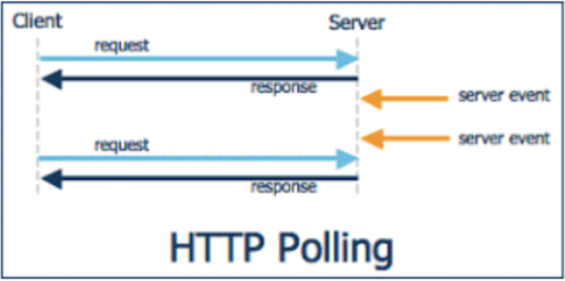

### **[해결방법 2]: 서버 측 Cron 작업을 이용한 삭제**
---

서버 측에서 Cron 작업을 스케줄링하여 데이터 삭제를 자동으로 진행하는 방법입니다. 이 방식은 서버가 실행 중일 때 정기적으로 데이터를 삭제할 수 있게 해 줍니다. 그러나 이 방법의 경우 서버가 종료되었을 경우, 예정된 삭제 작업이 실행되지 않는 단점이 있었습니다.

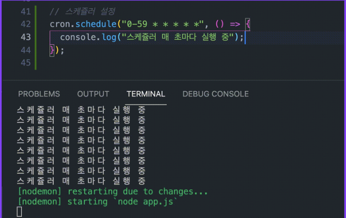

### **[해결방법 3]: MongoDB의 TTL(Time-To-Live) 기능을 활용한 자동 삭제**
---

MongoDB의 TTL 기능을 이용하는 방법은 데이터베이스 자체에서 데이터 삭제를 자동으로 관리할 수 있게 해 줍니다. 댓글이 생성될 때, 해당 댓글의 생명 주기를 1시간으로 설정하고 이 정보를 데이터베이스에 저장합니다. TTL 기능은 설정된 생명 주기가 지나면 자동으로 데이터를 삭제합니다. 이 방식의 가장 큰 장점은 클라이언트나 서버의 실행 여부와 상관없이 데이터베이스가 자체적으로 데이터를 관리하고 삭제할 수 있다는 것입니다.

```jsx
commentSchema.pre("save", async function (next) {
  if (this.creator.toString() === process.env.NON_MEMBER) {
    this.expiresAt = new Date(Date.now() + 60 * 60 * 1000);
  }

  next();
});
```

위와 같은 이유로 MongoDB의 Time-To-Live(TTL) 기능을 선택했습니다.
이 방식을 택함으로써, 비회원 댓글 관리가 보다 간단해졌고, 서버나 클라이언트 측에서 별도로 삭제 로직을 처리할 필요가 없게 구현 할 수 있었습니다.

## 2. 이미지를 어떻게 저장하고, 불러올까?

### [해결방법 1]: 이미지를 base64 사용하여 인코딩, 디코딩
---

프로젝트를 진행하면서 사용자가 댓글 작성 화면을 캡처한 스크린샷과 프로필 이미지 처리에 대한 필요성이 대두되었습니다. 해결책으로, 이미지를 Base64로 인코딩하여 인코딩된 문자열을 데이터베이스에 저장하는 방식을 적용해 보았습니다.

```jsx
  try {
    const screenshot = await new Promise((resolve) => {
      chrome.tabs.captureVisibleTab(
        { format: "png", quality: 90 },
        (imageUrl) => {
          resolve(imageUrl);
        },
      );
    });
  }
    const encodeScreenshot = btoa(screenshot);
```

### base64의 문제점
---

이 방법은 구현 가능성을 입증하였지만, 이미지를 데이터베이스에 직접 저장함으로써 발생하는 두 가지 문제점에 직면하게 되었습니다:

1. **데이터베이스 용량 사용 증가**: base64 인코딩 방식은 이미지를 문자열로 변환하여 서버에 저장하고, 이로 인해 이미지 데이터의 용량이 증가하는 단점이 있었습니다. 이미지의 크기를 줄이거나 데이터를 압축하는 등의 조치를 취할 수 있었지만, 여전히 큰 용량을 차지하여 데이터베이스의 성능에 부정적인 영향을 미칠 수 있었습니다. 또한, DB 응답이 느려지는 등의 문제가 발생했습니다.

2. **로딩 시간 증가**: 기존에는 base64로 인코딩된 이미지를 서버에서 전달해주고, 클라이언트에서는 해당 이미지를 디코딩한 후 뿌려주는 방식을 사용했습니다. 이로 인해 클라이언트는 이미지를 디코딩하는 추가적인 작업을 처리해야 하고, 대시보드 페이지와 같이 한 번에 여러 개의 코멘트를 가져와야 하는 상황에서는 로딩 시간이 길어지는 성능 이슈가 발생했습니다.

### [해결방법 2]: AWS S3 사용하기
---

이러한 문제를 해결하기 위해, 이미지를 직접 저장하는 대신 Amazon S3에 이미지를 업로드하고, 업로드된 이미지의 URL을 데이터베이스에 저장하는 방식으로 전략을 변경했습니다. 이 변경으로 인해 이미지 로딩 시간이 단축되고, 데이터베이스의 부하도 크게 감소했습니다.

### S3에 CloudFront 적용하기
---

<div>
  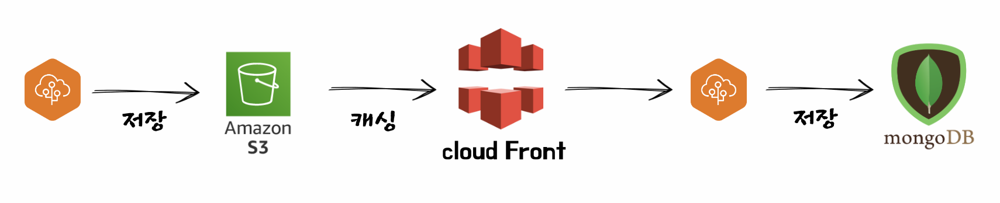
</div>

더 나아가 로딩 시간을 단축시키기 위해 AWS의 CDN 서비스인 CloudFront를 도입했습니다. CloudFront는 사용자에게 더 가까운 위치에서 웹 콘텐츠를 제공하여 웹 성능과 속도를 향상시키는 기술입니다. CloudFront를 적용한 결과, 특히 해외 사용자의 로딩 시간이 평균적으로 10배 이상 빨라졌습니다. 이는 서울에 위치한 서버를 사용할 때와 비교했을 때 큰 개선으로, 글로벌 사용자 경험을 향상시킬 수 있었습니다.

### S3만 사용 vs CloudFront 적용 비교
---

<div align="center">
  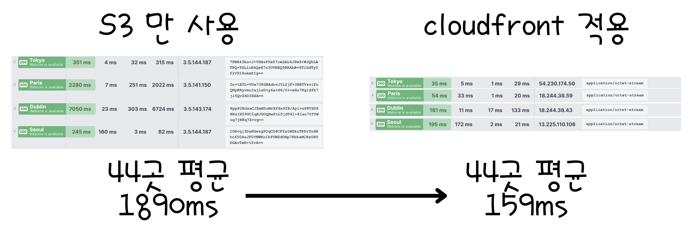
</div>

**S3만 사용하는 경우 장단점**
---

장점:

- 저장 용량 무제한: 대규모 파일 저장이 가능하며, 데이터의 안정적인 백업을 보장합니다.

- 비용 효율적: 데이터의 저장과 검색 비용이 합리적입니다.

- 간편한 통합: 다양한 AWS 서비스와 쉽게 통합할 수 있습니다.

단점:

- 지연 시간: 모든 요청이 지정된 S3 버킷 위치로 전송되기 때문에, 특히 물리적으로 먼 사용자에게는 지연 시간이 발생할 수 있습니다.

- 대역폭: 많은 트래픽을 처리할 때 대역폭에 대한 부담이 증가할 수 있습니다.

**CloudFront 적용 장단점**
---

S3와 결합하여 사용하면 다음과 같은 이점을 얻을 수 있습니다:

장점:

- 빠른 콘텐츠 전달: 사용자와 가까운 엣지 로케이션에서 콘텐츠를 제공하여 지연 시간을 최소화합니다.

- 글로벌 커버리지: 전 세계 어디에서나 빠르고 안정적으로 콘텐츠를 제공할 수 있습니다.

- 트래픽 분산: 트래픽이 분산되므로 특정 서버에 과부하가 걸리는 것을 방지합니다.

- 보안 강화: SSL/TLS 암호화, DDoS 방어 등 다양한 보안 기능을 제공합니다.

단점:

- 추가 비용: CloudFront를 사용하는 것은 추가 비용이 발생할 수 있습니다.

- 설정 복잡성: 초기 설정 및 관리가 S3만 사용하는 것보다 복잡할 수 있습니다.

>  CloudFront를 적용하여 글로벌 사용자들에게 빠르고 안정적인 콘텐츠 제공이 가능해졌으며, 이는 전체적인 사용자 경험을 향상시켰습니다.

<br>

## 3. 일관 되지 않은 스타일

<div align="center">
  <div style="center">
    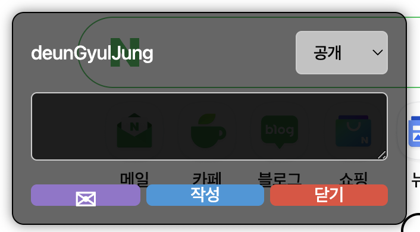
    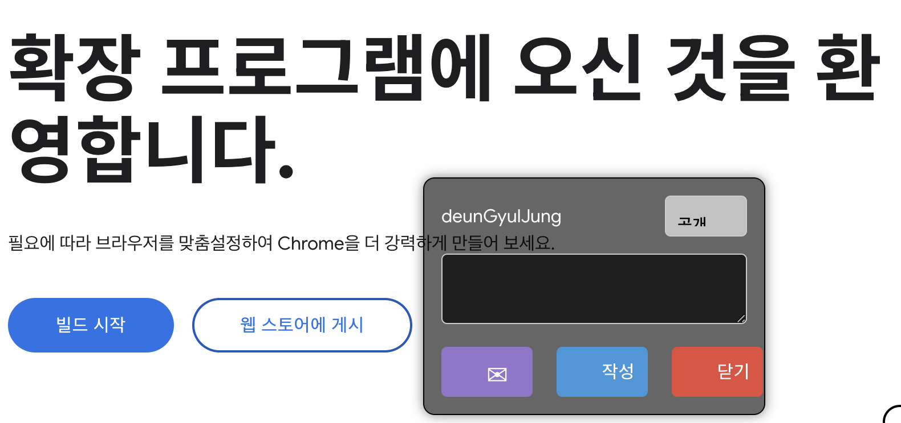
  </div>
</div>

이번 프로젝트에서는 크롬 익스텐션을 활용하여 구현한 모달 창, 토글 및 호버 스타일이 일부 웹 페이지에서만 적용되는 문제가 발생하였습니다. 이러한 문제는 웹 페이지의 DOM 구조나 스타일 시트의 차이로 인해 발생한 것으로 분석되었습니다.

이는 사용자의 경험과 의도치 않은 버그의 가능성을 고려할 때, 모든 웹 페이지에서 이러한 기능이 일관되게 작동하도록 보장해야 했습니다.

### [해결방법 1]: 3가지의 접근 방식 적용
---

이를 해결하기 위해 우리는 다음과 같은 접근 방식을 적용해보았습니다:

1. 유연한 스타일 적용: 가능한 한 유연한 CSS 선택자를 사용하여 각 요소를 정확하게 식별하고, 일관된 스타일을 적용해보았습니다.

2. 스타일 충돌 회피: 스타일 시트의 충돌을 최소화하기 위해 각 요소에 대한 스타일을 지정할 때, 가능한 일반화되지 않은 접근 방식을 사용해보았습니다.

3. 동적 DOM 조작: content script를 통해 웹 페이지의 DOM에 동적으로 접근하고, 필요한 요소를 정확하게 식별하여 스타일을 적용했습니다.

> 하지만 위와 같이 접근 할 경우에도 문제가 발생할 수 있습니다.

<div align="center">
    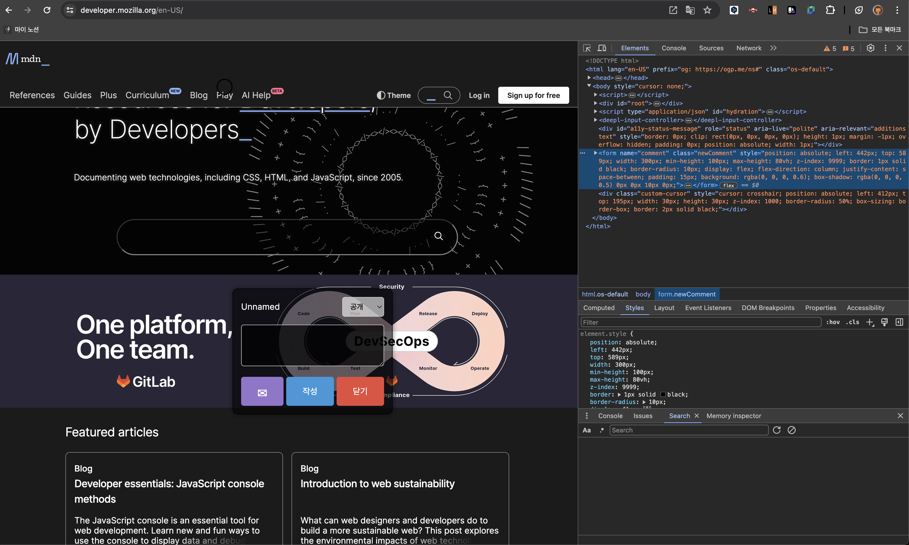
</div>

### 3 가지의 접근 방식 실패 요인
---

HTML 문서의 모든 요소와 스타일로 구성되어 있는 DOM은 하나의 글로벌 범위 내에 존재하게 됩니다. 그렇기 때문에, 모든 Element는 document 객체의 `querySelector()` 메서드로 접근할 할 수 있습니다. CSS 또한 document 내의 모든 해당하는 엘리먼트에 적용됩니다. 그렇기 때문에 글로벌 DOM에 직접 삽입하게 된다면 해당 DOM의 스크립트 요소에 영향을 받을 수 있게되고, 해당 페이지에서 실행되는 JavaScript 코드나 스타일 시트의 영향을 받게 됩니다.

> 따라서 이 방법은 웹 페이지의 다른 요소들과의 상호작용이나 충돌 가능성이 있었습니다.

### [해결방법 2]: Shadow DOM 사용
---

<div align="center">
  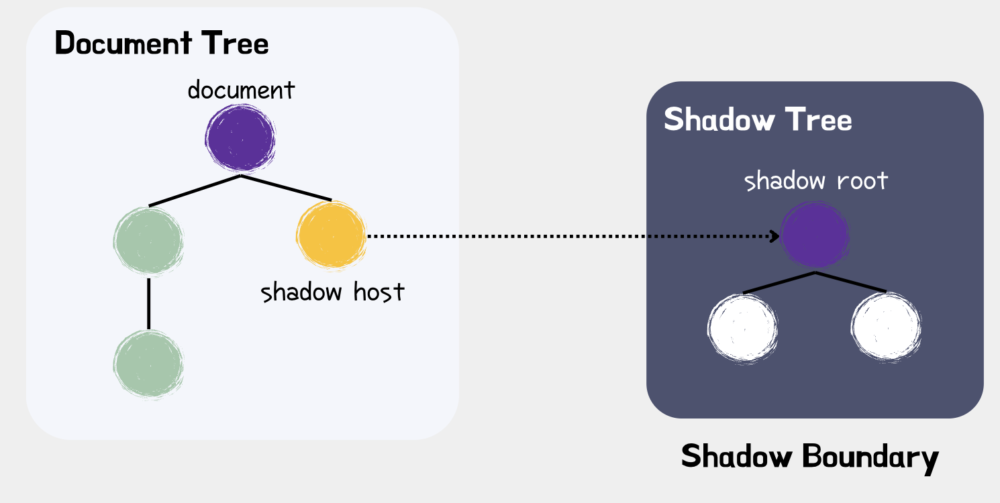
</div>

저희는 기존에 있던 글로벌 DOM에 새로운 요소를 넣어 분리 적용되는 스타일을 위해 Shadow DOM을 사용하였습니다.

Shadow DOM은 요소에 숨겨진 별도의 문서 객체 모델(DOM)을 첨부하여 작동하게 되는데,
이 숨겨진 DOM을 Shadow DOM이라고 하며, 연결된 요소를 'Shadow Host'라고 합니다.
Shadow DOM은 추가적인 Shadow Host가 그 하위에 중첩될 수 있는데, 이를 'Shadow Tree'라고 합니다. Shadow DOM 사용의 장점은 크게 세가지로 캡슐화, 독립성, 재사용성이 있습니다.

- 캡슐화: Shadow DOM의 캡슐화는 CSS와 JavaScript의 격리를 의미합니다. Shadow DOM 내의 스타일과 스크립트가 해당 DOM에만 영향을 미치고 페이지의 나머지 부분과 충돌하지 않는 것을 뜻하며, 이를 통해 CSS가 누출되는 문제를 해결하고, 페이지의 다른 스타일과 충돌없이 요소를 스타일링할 수 있습니다.

- 독립성: Shadow DOM은 특정 요소에 첨부되므로 독립된 환경을 형성합니다. 요소와 해당 Shadow DOM이 응용 프로그램의 나머지 부분과 독립적으로 개발, 테스트 및 배포될 수 있게 됩니다. 이러한 독립성은 대규모 응용 프로그램을 관리하기 쉽게 만들며, 개발자는 개별 구성 요소를 독립적으로 작업하여 응용 프로그램의 복잡성을 줄이고 유지 관리성을 향상시킬 수 있습니다.

- 재사용성: Shadow DOM의 재사용성은 웹 개발에 중요한 이점 중 하나인데, Shadow DOM으로 구축된 구성 요소는 필요한 모든 스타일과 동작을 캡슐화하여 자체 포함된 단위가 됩니다. 해당 구성 요소를 응용 프로그램의 다른 부분 또는 다른 응용 프로그램에서 재사용할 수 있습니다.

### **Shadow DOM의 closed 속성**
---

<div align="center">
    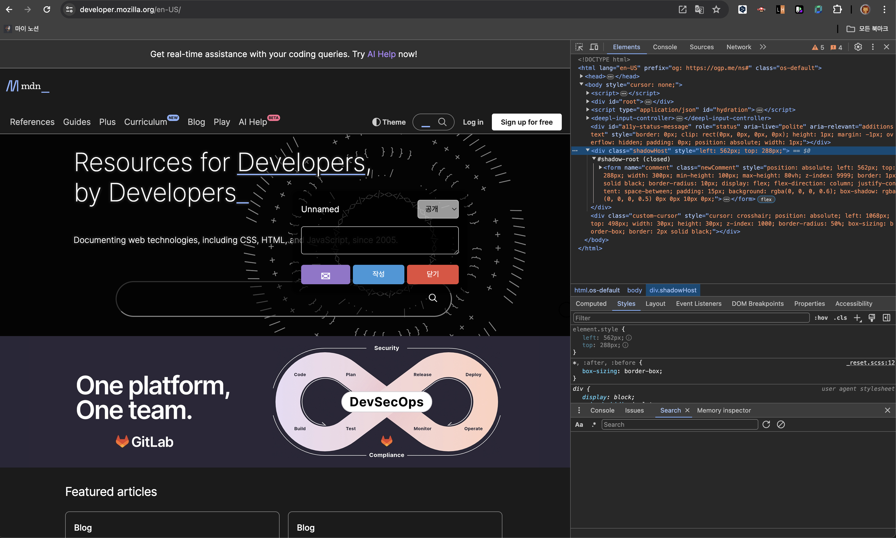
</div>

> closed로 설정된 Shadow DOM은 외부에서 접근할 수 없습니다. 이는 JavaScript로 DOM을 조작하거나 스타일을 적용할 때 해당 Shadow DOM 그 자체로 완전히 캡슐화되어 외부에서 해당 내용을 변경할 수 없게 됩니다.
>
> Shadow DOM을 사용함으로 써 일관 되지 않게 적용 되던 스타일이 외부에 영향을 받지 않게되어 문제를 해결하였습니다.

## **👨🏻‍🏫 Memoir**

### 권성한

이번 팀 프로젝트는 처음으로 본격적인 협업을 경험하면서 많은 도전과 성장의 기회였습니다. 프로젝트 아이디어부터 일정 계획, 구현 우선순위, 그리고 깃 전략과 브랜치 명, 커밋 메시지 컨벤션 등의 작업 방식을 토론하고 결정하는 과정이 힘들기도 했지만, 그만큼 더 많은 것을 배우고 경험할 수 있었습니다. 프로젝트 초기에는 방향성과 개발 스타일이 서로 다르다는 점에서 어려움도 있었지만, 모두가 좋은 프로젝트를 만들고자 하는 공동의 목표 아래 의견을 절충하고 수용 가능한 방향을 찾아 나갈 수 있었습니다.

이번 프로젝트를 통해 처음으로 크롬 익스텐션 개발에 도전했는데, 기존의 개발 환경과는 달라 초기에는 어려움을 겪기도 했습니다. 처음에는 간단하게 보였던 부분에서 오랜 시간 막혀 고생하기도 했지만, 이럴 때마다 팀원과 함께 문제를 파악하고 해결해 나가면서 프로젝트를 성공적으로 마칠 수 있었습니다. 혼자였다면 해결하기 어려웠을 문제들을 팀원과 함께 극복할 수 있었고, 이 경험은 협업의 중요성을 더욱 깊이 이해하게 만들었습니다.

이번 프로젝트를 통해 깃을 통한 협업 과정, 그리고 팀원과의 의사소통 능력을 키울 수 있었습니다. 이 경험을 바탕으로 앞으로 더 많은 개발자들과의 협업에 자신감을 가지고 임할 수 있게 되었습니다.

### 정든결

이번 팀 프로젝트에서 가장 좋았던 점은 저희의 협업이었습니다. 처음에는 서로 다른 개발 스타일과 관점에서 충돌이 있을 것이라고 예상했지만, 그것을 극복하고 함께 성장하는 기회로 삼을 수 있었습니다. 각자의 아이디어를 존중하고 토론을 거쳐 합리적인 결정을 내리는 과정에서 우리 팀의 힘을 느낄 수 있었습니다.

특히, 크롬 익스텐션 개발이라는 새로운 도전에 직면했을 때 우리 팀은 단합하여 문제를 해결했습니다. 처음에는 낯선 개발 환경과 도구들로 인해 어려움을 겪었지만, 서로의 지식과 경험을 공유하며 한 걸음씩 앞으로 나아갈 수 있었습니다.

물론, 저희가 진행한 프로젝트에서는 몇 가지 개선할 점도 있었습니다. 더 효율적인 일정 관리와 작업 분배, 그리고 더 명확한 커뮤니케이션 방식이 필요했던 부분이었습니다. 하지만 이러한 도전으로 인해 앞으로 개발자로서 개선할 점을 알 수 있었습니다. 앞으로의 프로젝트에서는 더 나은 방향으로 발전할 수 있을 것이라고 생각합니다.

이번 프로젝트를 통해 우리는 협력과 의사소통의 중요성을 깨닫게 되었습니다. 각자의 역할과 책임을 이해하고 서로의 강점을 살려 팀의 목표를 달성하기 위해 노력했습니다. 이러한 경험을 토대로 앞으로도 더 나은 프로젝트를 위해 노력하고 성장해 나갈 것입니다.
